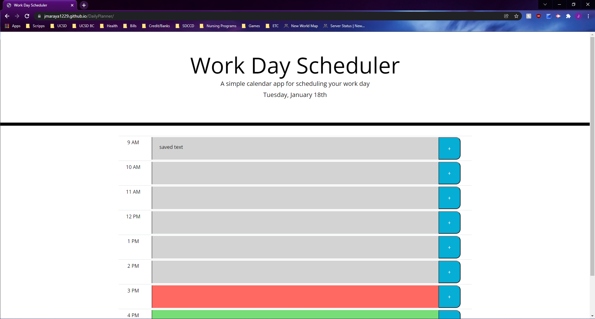

# Work Day Planner

## Description

The following application is an interactive planner the user can use to plan out their work day. Following a standard 9am-5pm format, the user can type in the text area and save their data in the specific timeblock in order to manage their time effectively. 

### Functionality
* When the user opens the planner, the current day is displayed at the top of the calendar.
* When the user scrolls down, they will see timeblocks for standard business hours. 
* When the user views the timerblocks for the day, they will see that each timeblock is color coded to indicate whether it is in the past, present, or future. 
* When the user clicks into a timeblock, they will be able to enter an event. 
* When the user clicks the save button for that timeblock, the text for that event will be saved in the local storage. 
* When the user refreshes the page, the saved events will persist. 

## Screenshot 
The following screenshot demonstrates the application functionality:

## Link

* https://jmaraya1229.github.io/DailyPlanner/